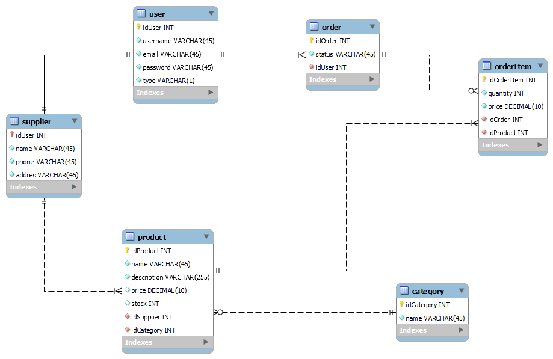

# **Guia para Configuração do Projeto**

Este tutorial irá guiá-lo para configurar e executar o projeto em sua máquina local.

---

## **Visão Geral do Projeto**



TechHub é um e-commerce desenvolvido como parte de um projeto acadêmico para a disciplina de Programação Web da UFLA. O sistema permite a gestão de produtos, categorias, pedidos e fornecedores, além de oferecer um ambiente administrativo robusto.

---

## **1. Pré-requisitos**

Antes de começar, certifique-se de que os seguintes itens estão instalados em sua máquina:

- **Python** (versão 3.10 ou superior): [Download Python](https://www.python.org/downloads/)
- **Pip**: Geralmente já vem com o Python.

- **Git** (para clonar o repositório): [Download Git](https://git-scm.com/)

---

## **2. Clonar o Repositório**

Faça o clone do repositório do projeto em sua máquina local.

## **3. Criar um Ambiente Virtual**

Crie e ative um ambiente virtual para o projeto:

### **No Windows**:
1. Crie o ambiente virtual:
   ```bash
   python -m venv venv
   ```

2. Ative o ambiente virtual:
   ```bash
   venv\Scripts\activate
   ```

   Ou:
    ```bash
   venv\Scripts\Activate.ps1  
   ```


## **4. Instalar Dependências**

Com o ambiente virtual ativado, instale as dependências do projeto listadas no arquivo `requirements.txt`:

```bash
pip install -r requirements.txt
```

---

## **5. Configurar o Banco de Dados**

Execute as migrações para configurar o banco de dados:

```bash
python manage.py migrate
```

---

## **6. Criar um Superusuário (Opcional)**

Se desejar acessar o painel administrativo do Django, crie um superusuário:

```bash
python manage.py createsuperuser
```

Siga as instruções fornecidas no terminal para definir o nome de usuário, email e senha.

---

## **7. Rodar o Servidor Local**

Execute o servidor de desenvolvimento do Django para testar o projeto:

```bash
python manage.py runserver
```

Acesse o projeto no navegador no seguinte endereço:
```
http://127.0.0.1:8000/
```

---

## **8. Configurar Variáveis de Ambiente (Opcional)**

Se o projeto usa variáveis de ambiente, crie um arquivo `.env` na raiz do projeto e configure as chaves necessárias. Consulte o responsável pelo projeto para obter os valores corretos.

---

## **9. Possíveis Erros e Soluções**

### **Erro 1: `pip` não encontrado**
- Certifique-se de que o Python e o Pip estão instalados corretamente e adicionados ao `PATH`.

### **Erro 2: `ModuleNotFoundError`**
- Certifique-se de que todas as dependências foram instaladas com:
  ```bash
  pip install -r requirements.txt
  ```

### **Erro 3: Problemas com Migrações**
- Se houver problemas com o banco de dados, tente apagar o arquivo `db.sqlite3` (ou equivalente) e executar novamente:
  ```bash
  python manage.py migrate
  ```

---

## **10. Finalização**

Parabéns! O projeto está configurado e rodando em sua máquina. Agora você pode começar a utilizá-lo ou desenvolvê-lo.

---

© Projeto desenvolvido por Bernardo Nunes Leris e Michel Alexandrino de Souza para a disciplina Programação Web, realizada na Universidade Federal de Lavras.

---